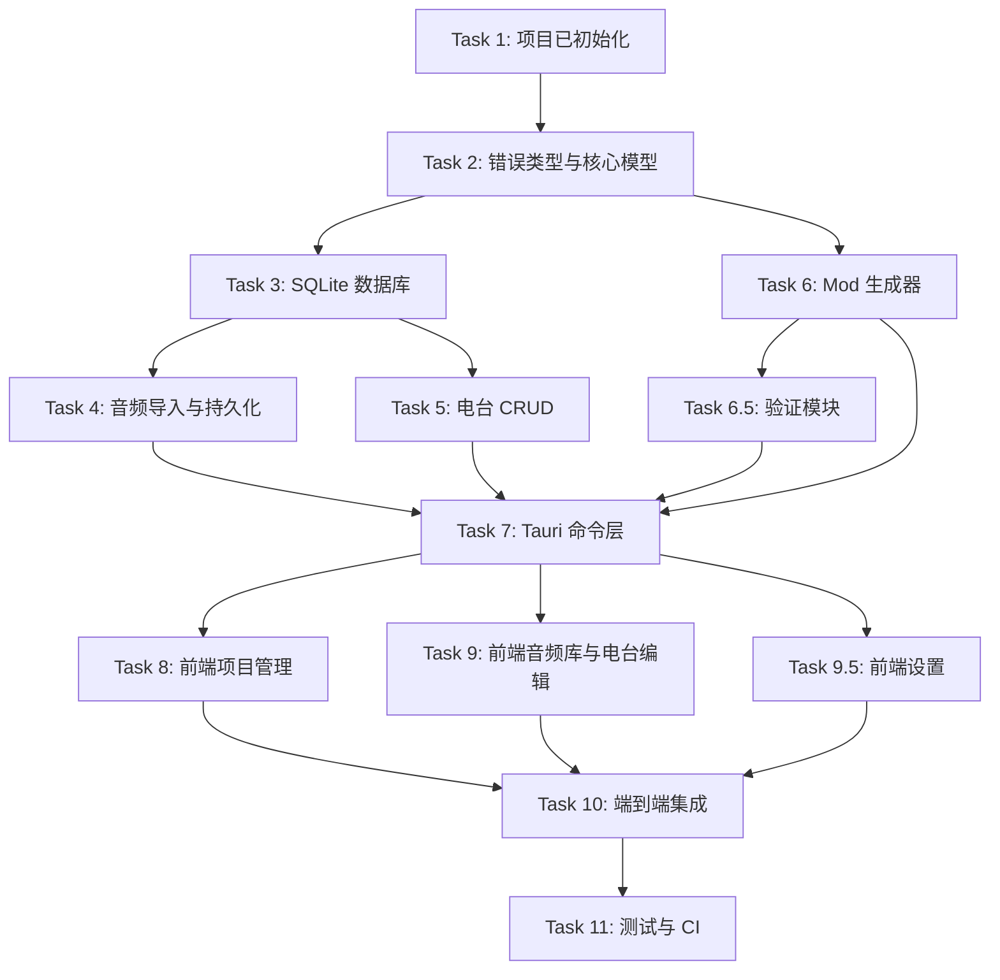

# HOI4 Radio Maker 实施路线图

本文档基于 [设计规格](specs/2026-06-12-hoi4radio-design.md) 和 [实现计划](plans/2026-06-12-hoi4radio-implementation-plan.md)，梳理各任务的执行顺序、依赖关系以及可并行项。

## 一、总体阶段

| 阶段 | 目标 | 主要任务 | 预计可并行度 |
|---|---|---|---|
| **P0 基础搭建** | 项目已初始化，完成可运行骨架 | Task 1 | 已完成 |
| **P1 后端基础** | 定义错误类型、数据模型、数据库 | Task 2 ~ 3 | 低 |
| **P2 后端领域** | 实现音频、电台、生成器、验证器 | Task 4 ~ 6.5 | 高 |
| **P3 命令层** | 将后端能力暴露为 Tauri Command | Task 7 | 低 |
| **P4 前端界面** | 完成项目管理、音频库、电台编辑、设置界面 | Task 8 ~ 9.5 | 高 |
| **P5 集成与质量** | 端到端验证、测试、CI | Task 10 ~ 11 | 中 |

## 二、任务依赖图



## 三、任务清单与依赖

| 任务 | 内容 | 前置依赖 | 可并行任务 |
|---|---|---|---|
| Task 1 | 项目 Bootstrapped | 无 | 已完成 |
| Task 2 | 错误类型与核心模型 | Task 1 | 无 |
| Task 3 | SQLite 数据库与迁移 | Task 2 | 无 |
| Task 4 | 音频导入、分析、转码、持久化 | Task 3 | Task 5, Task 6（部分） |
| Task 5 | 电台模型与 CRUD | Task 3 | Task 4, Task 6（部分） |
| Task 6 | HOI4 Mod 文件生成器 | Task 2（模型） | Task 4, Task 5 |
| Task 6.5 | 输出验证模块 | Task 6 | Task 4, Task 5 |
| Task 7 | Tauri Command 层 | Task 3, 4, 5, 6, 6.5 | 无 |
| Task 8 | Vue 前端 — 项目管理 | Task 7 | Task 9, Task 9.5 |
| Task 9 | Vue 前端 — 音频库与电台编辑 | Task 7 | Task 8, Task 9.5 |
| Task 9.5 | Vue 前端 — 设置 | Task 7 | Task 8, Task 9 |
| Task 10 | 端到端集成 | Task 7, 8, 9 | Task 9.5（可选） |
| Task 11 | 测试与 CI | Task 2 ~ 10 | 无 |

## 四、推荐并行执行方案

### Phase 1：后端基础（串行）

必须按顺序完成，因为后续所有模块都依赖它们：

```
Task 2 → Task 3
```

### Phase 2：后端领域模块（可并行）

Task 4、Task 5、Task 6 之间没有强依赖，可并行开发：

- **小组 A**：Task 4（音频分析、转码、持久化）
- **小组 B**：Task 5（电台 CRUD）
- **小组 C**：Task 6（Mod 生成器，仅需 Task 2 的模型）

Task 6.5（验证器）需在 Task 6 完成后启动，但可与 Task 4/Task 5 并行：

- **小组 D**：Task 6.5（验证器，依赖 Task 6）

### Phase 3：命令层（串行）

Task 7 是前后端集成的枢纽，必须等 Phase 2 全部完成后才能进行：

```
Task 4 + Task 5 + Task 6 + Task 6.5 → Task 7
```

### Phase 4：前端界面（可并行）

Task 7 完成后，三个前端视图可并行开发：

- **小组 A**：Task 8（项目管理）
- **小组 B**：Task 9（音频库与电台编辑）
- **小组 C**：Task 9.5（设置）

### Phase 5：集成与质量（串行为主）

```
Task 8 + Task 9 (+ Task 9.5) → Task 10 → Task 11
```

## 五、关键里程碑

| 里程碑 | 判定标准 | 涉及任务 |
|---|---|---|
| **M1 后端核心就绪** | `cargo test` 在 `src-tauri/` 全部通过，数据库与领域模型稳定 | Task 2 ~ 6.5 |
| **M2 命令层就绪** | 前端可通过 Tauri Command 调用所有后端能力 | Task 7 |
| **M3 UI 功能完整** | 项目管理、音频库、电台编辑、设置界面均可操作 | Task 8 ~ 9.5 |
| **M4 端到端跑通** | 能完整创建一个项目 → 导入音频 → 创建电台 → 生成 Mod → 验证输出 | Task 10 |
| **M5 质量门禁** | CI 通过，集成测试覆盖核心流程 | Task 11 |

## 六、风险与注意事项

1. **Task 3 数据库是瓶颈**
   - Task 4、Task 5、Task 6 都需要 `db.rs` 提供的接口。建议 Task 3 完成后冻结数据库 schema，后续只做增量字段添加。

2. **Task 6 生成器可被提前开发**
   - 由于生成器主要依赖模型数据，不依赖真实数据库，可在 Task 2 完成后就开始，用测试数据驱动开发。

3. **Task 6.5 验证器依赖生成器输出格式**
   - 需要等 Task 6 的输出文件结构稳定后再启动，否则验证逻辑会频繁返工。

4. **Task 7 需要跨模块协调**
   - 命令层会同时调用 `db.rs`、`audio_repo.rs`、`station.rs`、`generator.rs`、`validator.rs`，建议由熟悉整体结构的人统一实现。

5. **前端 Task 8 / 9 / 9.5 可并行，但需统一 UI 规范**
   - 建议先由 Task 8 确立 Vuetify 3 (Material Design 3) 主题、布局、组件使用方式，再并行开发 Task 9 和 Task 9.5。

## 七、最小可行路径（MVP Fast Track）

如果资源有限，希望最快交付可用版本，可按以下顺序聚焦：

```
Task 2 → Task 3 → Task 4 → Task 5 → Task 6 → Task 7 → Task 8 → Task 10
```

此路径跳过 Task 6.5（验证器）、Task 9.5（设置）和 Task 11（CI），先生成可手动验证的端到端原型。后续再补齐：

```
Task 6.5 → Task 9 → Task 9.5 → Task 11
```

## 八、执行建议

- 每个 Task 完成后运行对应测试，通过后再进入下一阶段。
- Phase 2 和 Phase 4 推荐用子代理并行推进，但需统一代码审查。
- Task 7 和 Task 10 建议由同一开发者或子代理负责，以保证前后端接口命名一致。

---

## 九、实际 HOI4 文件复核后的状态与补充任务

基于 2026-06-15 对游戏本体（`Hearts of Iron IV/music/`、`hoi2/`、`hoi3/`）及 8 个 Steam Workshop 音乐 Mod 的抽样复核，Must Have 主体功能已基本实现，但存在若干影响游戏内可用性或数据质量的问题。

### 9.1 当前总体状态

| 阶段 | 状态 | 备注 |
|---|---|---|
| P0 基础搭建 | ✅ 完成 | Tauri + Vue 3 骨架可运行 |
| P1 后端基础 | ✅ 完成 | 模型、错误类型、SQLite 迁移稳定 |
| P2 后端领域 | ✅ 基本完成 | 音频、电台、生成器、验证器已落地 |
| P3 命令层 | ✅ 完成 | Tauri Command 已注册 |
| P4 前端界面 | ✅ 基本完成 | 项目管理、音频库、电台编辑、设置均已可用 |
| P5 集成与质量 | ✅ 完成 | 高优先级兼容性（9.2）、中优先级体验（9.3）、CI 质量门禁（Task 11）均已完成 |

### 9.2 高优先级（影响游戏内可用性）— ✅ 已完成

| 任务 | 说明 | 状态 | 提交 |
|---|---|---|---|
| 本地化文件写入 UTF-8 BOM | 游戏要求 `.yml` 本地化文件以 UTF-8 BOM 开头 | ✅ 完成 | `dfcb175` |
| 验证器使用配置 ffprobe 路径 | `validate_mod_output` 从 settings 读取 ffprobe 路径 | ✅ 完成 | `d3f474c` |
| 转码强制双声道输出 | ffmpeg 参数强制 `-ac 2` 立体声输出 | ✅ 完成 | `c8b5c97` |
| ID3 标签读取标题/艺术家 | 导入时读取嵌入 title/artist 写入记录 | ✅ 完成 | `29f7702` |

> 4 项均按 `plans/2026-06-15-hoi4-compatibility-and-quality-plan.md` 的 TDD 流程实现（失败测试 → 实现 → 通过），已合并至 main。

### 9.3 中优先级（体验与工程债务）

| 任务 | 说明 | 状态 | 提交 |
|---|---|---|---|
| 导入完成后再建立项目引用 | 避免项目音频列表短暂出现 pending 条目 | ✅ 完成 | `32e6a24` |
| 生成可读电台/歌曲 ID | 替代 `station_<uuid>` / `audio_<uuid>`，便于调试和与现有 Mod 风格一致 | ✅ 完成 | `32e6a24` |
| 拖拽导入 | 提升音频库交互效率 | ✅ 完成 | `32e6a24` |
| 拆分哈希/转码并发度 | 设计文档要求哈希与转码使用不同并发度 | ✅ 完成 | `8ed7843` |
| 项目输出目录与 `.mod` 路径一致性 | 用户手动选择非标准目录时，`path` 字段可能失效 | ✅ 完成 | `4abccb9` |

### 9.4 低优先级 / 可选

| 任务 | 说明 | 状态 | 提交 |
|---|---|---|---|
| Steam Workshop 一键上传 | 设计文档 Nice-to-have；评估后确认上传由官方启动器提供，本工具不再实现 | ⛔ 放弃 | |
| 多语言界面 | 前后端文案双语（简体中文主 / 英文），默认跟随系统语言，设置内可切换 | ✅ 完成 | `499d7ef` |
| 与 hoi4skill 共享 Clausewitz 索引验证 trigger | 设计文档 Nice-to-have；评估后改为**自建词表**实现（未依赖 hoi4skill），详见 9.7 | ✅ 完成 | `cfd0344`…`f6301cf` |
| 真实音频波形可视化 | 当前为占位动画 | 🔄 待做 | |
| 子目录/多 `.asset` 结构 | 每个电台输出到各自的 `music/<子目录>/`（asset/txt/ogg 同目录，Workshop 主流布局）；目录名默认由电台名生成，可按电台自定义覆盖 | ✅ 完成 | `da95f70` |

### 9.5 推荐下一步

9.3、9.4 的「子目录/多 `.asset` 结构」「多语言界面」「与 hoi4skill 共享索引验证 trigger」（改用自建词表）均已完成并合并至 main（`32e6a24` / `da95f70` / `5c3fdd6` / `499d7ef` / `cfd0344`…`f6301cf`）；「Steam Workshop 一键上传」已确认不做。

**9.4 现仅剩一项**：「真实音频波形可视化」（当前为占位动画，见 `AudioArchiveView.vue` 的 `.wave-bar`）。属 Nice-to-have。

**已合并但未记录的额外工作**（2026-09-11）：trigger 词表来源功能顺带产出的三类改动，均已在 main：
- **按 trigger 类型渲染取值控件**：布尔→是/否下拉、数值→数字输入、文本→可搜索下拉（`f9832b0`）
- **播放条件弹窗宽度随内容自适应**：短内容回到原始 640px，最长 trigger 名（82 字符）时扩展到 1288px（`428fde5`）
- **取值类型全量索引**：选 trigger 不再卡顿，单次查询 1.98 s → 418 ns（`f6301cf`）

### 9.6 CI/CD — ✅ 已完成

| 能力 | 说明 | 触发 |
|---|---|---|
| 质量门禁 | 前端 vue-tsc 类型检查 + Rust fmt/clippy/测试 | 每次 push 到 main 与 PR |
| 发布构建 | tauri-action 跨平台构建 Linux/Windows/macOS 并发布到 GitHub Release | `v*` 版本 tag（如 `v0.1.0`） |

工作流位于 `.github/workflows/ci.yml` 与 `.github/workflows/release.yml`。Rust 通过 `rust-toolchain.toml` 固定 stable + rustfmt/clippy 组件；前端用 `bun install --frozen-lockfile`；Rust 测试在 CI 安装 `ffmpeg` 后完整运行转码/验证器集成测试。

### 9.7 「共享 Clausewitz 索引验证 trigger」— ✅ 已以自建词表取代

**原始意图**（设计文档 §3.3 / §12）：电台 `.txt` 里的 `chance = { modifier = { … <trigger> } }` 目前只支持固定的 4 种条件（`has_war` / `tag` / `has_government` / `is_in_faction_with`，见 `models.rs` 的 `Trigger` 枚举），生成时直接拼字符串（`generator.rs` 的 `format_trigger`）。验证器只检查 `.asset`/`.txt` 一致性、OGG 可解码性、本地化键与 ID 字符集，**不校验脚本语义**。原意是复用 hoi4skill 的 Clausewitz 索引校验这些 trigger 关键字/取值（如国家 tag、意识形态）是否真实存在。

**实际核查结论**（2026-08-17，检查本机 `~/code/Other/hoi4skill`）：

| 检查项 | 结果 |
|---|---|
| hoi4skill 是否提供可共享索引 | 是。`hoi4skill-cli build-game-index --game-root <路径>` 输出 JSON；另有 `build-clausewitz-library` / `query-clausewitz-library` |
| 索引是否含 trigger 词表 | **否**。`game_index.rs` 的 `GameIndex` 含 `effects`、`modifiers`，**没有 `triggers` 字段** |
| 索引可覆盖本项目的哪些取值 | `country_tags`（可用于 `tag` / `is_in_faction_with`）、`ideologies`（可用于 `has_government`）；`has_war` 是布尔量无需索引 |
| 是否检 trigger 语义 | 仅结构化处理 `trigger` 块上下文（`validate.rs` 的 `check_trigger_contexts`），无关键字合法性词表 |

**结论**：原设想（共享索引校验 trigger 关键字）当前**无法直接成立**——共享索引不含 trigger 词表。可选路径：

1. **放弃**：本项目 trigger 是封闭枚举（4 种）、由生成器拼写，拼错风险极低，收益有限。
2. **窄化实现（推荐）**：不引入跨仓库耦合，仅用本项目已有的 `hoi4_game_dir` 设置读取游戏自带文件，校验取值——`common/country_tags/*.txt` 校验 `tag` / `is_in_faction_with`，`common/ideologies/*.txt` 校验 `has_government`；未配置游戏目录时跳过。覆盖 4 种条件中的 3 种。
3. **完整共享**：先给 hoi4skill 的 `GameIndex` 增加 trigger 词表，再让本项目消费其 JSON。功能最全，但引入跨仓库依赖与版本协调成本。

---

#### 9.7 后续（2026-09-11）：以自建词表取代，未依赖 hoi4skill

上面三条路径**都没有走**。实际实现选择了第四条：**本项目自己从游戏与选定 mod 构建词表**，完全不引入 hoi4skill（`scripts.rs`，`cfd0344` 起共 12 个提交）。

| 原设想 | 实际实现 |
|---|---|
| 复用 hoi4skill 的共享索引 | **自建**。`scripts.rs` 从 `documentation/triggers_documentation.md`（596 条定义）+ `common/scripted_triggers/*.txt` 解析 trigger 名 |
| 校验 `tag` / `has_government` 取值（路径 2） | 已做，并且**同样自建**：`common/country_tags/*.txt`、`common/ideologies/*.txt` |
| trigger 是封闭 4 种枚举 | 扩展为 5 种：新增 `Trigger::Generic { name, value }`，取值来自词表，生成时按需加引号 |
| 验证器不校验 trigger 语义 | `validator.rs` 现按词表校验 `.txt` 赋值：未知 trigger / 未知 tag / 未知 ideology 均报 warning（`STRUCTURAL_KEYS` 排除 `music`/`song`/`factor`/`chance`/`modifier`/`add`/`base`；空词表跳过） |
| 不做（收益有限） | 额外做了**取值类型推断**：`ValueKindIndex` 一次遍历脚本语料，按实际用法判定 boolean/number/text，用于编辑态 UI 控件选择 |

**词表来源**：项目设置内选择「加载原版 trigger」（默认开）与任意多个创意工坊 mod（默认不加载）。实测原版 1519 triggers / 364 tags / 4 ideologies；叠加 mod 后增至约 1944 triggers / 683 tags / 15 ideologies。

**性能**：按取值类型查询最初为「每个名字重扫全语料」，在本机 10k 文件 / 120 MB 上单次 1.98 s 且阻塞 IPC 线程。改为 `ValueKindIndex` 一次遍历建全量索引并按来源集缓存后，同一查询 418 ns（选 trigger 时最大帧间隙 19 ms）。见 `f6301cf`。

9.4 中「与 hoi4skill 共享 Clausewitz 索引验证 trigger」一项据此标记为**已完成（改用自建词表）**。
