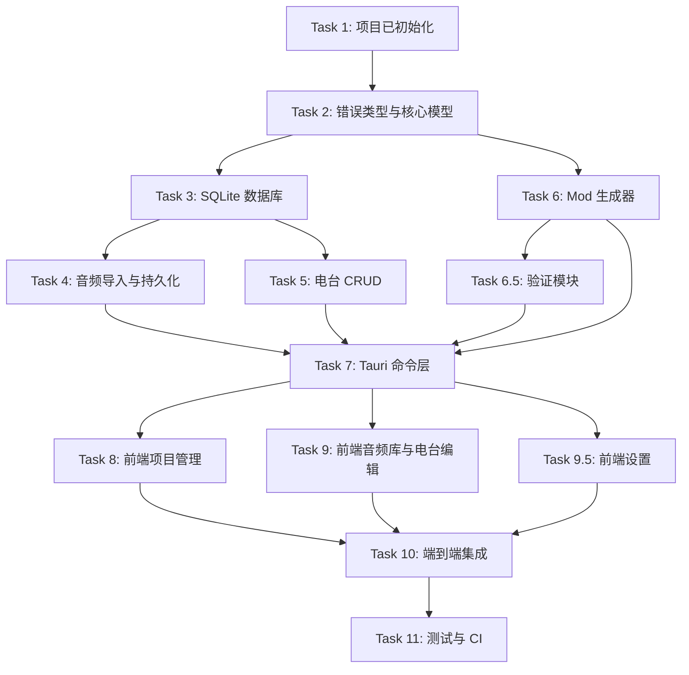

# HOI4 Radio Maker 实施路线图

本文档基于 [设计规格](specs/2026-06-12-hoi4radio-design.md) 和 [实现计划](plans/2026-06-12-hoi4radio-implementation-plan.md)，梳理各任务的执行顺序、依赖关系以及可并行项。

## 一、总体阶段

| 阶段 | 目标 | 主要任务 | 预计可并行度 |
|---|---|---|---|
| **P0 基础搭建** | 项目已初始化，完成可运行骨架 | Task 1 | 已完成 |
| **P1 后端基础** | 定义错误类型、数据模型、数据库 | Task 2 ~ 3 | 低 |
| **P2 后端领域** | 实现音频、电台、生成器、验证器 | Task 4 ~ 6.5 | 高 |
| **P3 命令层** | 将后端能力暴露为 Tauri Command | Task 7 | 低 |
| **P4 前端界面** | 完成项目管理、音频库、电台编辑、设置界面 | Task 8 ~ 9.5 | 高 |
| **P5 集成与质量** | 端到端验证、测试、CI | Task 10 ~ 11 | 中 |

## 二、任务依赖图



## 三、任务清单与依赖

| 任务 | 内容 | 前置依赖 | 可并行任务 |
|---|---|---|---|
| Task 1 | 项目 Bootstrapped | 无 | 已完成 |
| Task 2 | 错误类型与核心模型 | Task 1 | 无 |
| Task 3 | SQLite 数据库与迁移 | Task 2 | 无 |
| Task 4 | 音频导入、分析、转码、持久化 | Task 3 | Task 5, Task 6（部分） |
| Task 5 | 电台模型与 CRUD | Task 3 | Task 4, Task 6（部分） |
| Task 6 | HOI4 Mod 文件生成器 | Task 2（模型） | Task 4, Task 5 |
| Task 6.5 | 输出验证模块 | Task 6 | Task 4, Task 5 |
| Task 7 | Tauri Command 层 | Task 3, 4, 5, 6, 6.5 | 无 |
| Task 8 | Vue 前端 — 项目管理 | Task 7 | Task 9, Task 9.5 |
| Task 9 | Vue 前端 — 音频库与电台编辑 | Task 7 | Task 8, Task 9.5 |
| Task 9.5 | Vue 前端 — 设置 | Task 7 | Task 8, Task 9 |
| Task 10 | 端到端集成 | Task 7, 8, 9 | Task 9.5（可选） |
| Task 11 | 测试与 CI | Task 2 ~ 10 | 无 |

## 四、推荐并行执行方案

### Phase 1：后端基础（串行）

必须按顺序完成，因为后续所有模块都依赖它们：

```
Task 2 → Task 3
```

### Phase 2：后端领域模块（可并行）

Task 4、Task 5、Task 6 之间没有强依赖，可并行开发：

- **小组 A**：Task 4（音频分析、转码、持久化）
- **小组 B**：Task 5（电台 CRUD）
- **小组 C**：Task 6（Mod 生成器，仅需 Task 2 的模型）

Task 6.5（验证器）需在 Task 6 完成后启动，但可与 Task 4/Task 5 并行：

- **小组 D**：Task 6.5（验证器，依赖 Task 6）

### Phase 3：命令层（串行）

Task 7 是前后端集成的枢纽，必须等 Phase 2 全部完成后才能进行：

```
Task 4 + Task 5 + Task 6 + Task 6.5 → Task 7
```

### Phase 4：前端界面（可并行）

Task 7 完成后，三个前端视图可并行开发：

- **小组 A**：Task 8（项目管理）
- **小组 B**：Task 9（音频库与电台编辑）
- **小组 C**：Task 9.5（设置）

### Phase 5：集成与质量（串行为主）

```
Task 8 + Task 9 (+ Task 9.5) → Task 10 → Task 11
```

## 五、关键里程碑

| 里程碑 | 判定标准 | 涉及任务 |
|---|---|---|
| **M1 后端核心就绪** | `cargo test` 在 `src-tauri/` 全部通过，数据库与领域模型稳定 | Task 2 ~ 6.5 |
| **M2 命令层就绪** | 前端可通过 Tauri Command 调用所有后端能力 | Task 7 |
| **M3 UI 功能完整** | 项目管理、音频库、电台编辑、设置界面均可操作 | Task 8 ~ 9.5 |
| **M4 端到端跑通** | 能完整创建一个项目 → 导入音频 → 创建电台 → 生成 Mod → 验证输出 | Task 10 |
| **M5 质量门禁** | CI 通过，集成测试覆盖核心流程 | Task 11 |

## 六、风险与注意事项

1. **Task 3 数据库是瓶颈**
   - Task 4、Task 5、Task 6 都需要 `db.rs` 提供的接口。建议 Task 3 完成后冻结数据库 schema，后续只做增量字段添加。

2. **Task 6 生成器可被提前开发**
   - 由于生成器主要依赖模型数据，不依赖真实数据库，可在 Task 2 完成后就开始，用测试数据驱动开发。

3. **Task 6.5 验证器依赖生成器输出格式**
   - 需要等 Task 6 的输出文件结构稳定后再启动，否则验证逻辑会频繁返工。

4. **Task 7 需要跨模块协调**
   - 命令层会同时调用 `db.rs`、`audio_repo.rs`、`station.rs`、`generator.rs`、`validator.rs`，建议由熟悉整体结构的人统一实现。

5. **前端 Task 8 / 9 / 9.5 可并行，但需统一 UI 规范**
   - 建议先由 Task 8 确立 Naive UI 主题、布局、组件使用方式，再并行开发 Task 9 和 Task 9.5。

## 七、最小可行路径（MVP Fast Track）

如果资源有限，希望最快交付可用版本，可按以下顺序聚焦：

```
Task 2 → Task 3 → Task 4 → Task 5 → Task 6 → Task 7 → Task 8 → Task 10
```

此路径跳过 Task 6.5（验证器）、Task 9.5（设置）和 Task 11（CI），先生成可手动验证的端到端原型。后续再补齐：

```
Task 6.5 → Task 9 → Task 9.5 → Task 11
```

## 八、执行建议

- 每个 Task 完成后运行对应测试，通过后再进入下一阶段。
- Phase 2 和 Phase 4 推荐用子代理并行推进，但需统一代码审查。
- Task 7 和 Task 10 建议由同一开发者或子代理负责，以保证前后端接口命名一致。
